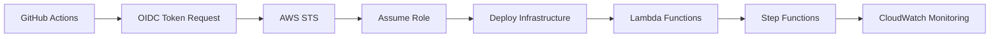

# 🚀 Deployment Guide: GitHub Actions CI/CD Pipeline

This document provides comprehensive instructions for deploying the AWS SSM Data Fetcher using GitHub Actions with full CI/CD automation.

## 🎯 Overview

The GitHub Actions CI/CD pipeline provides:
- **Automated deployments** across dev/staging/prod environments
- **OIDC authentication** for secure AWS access without long-lived credentials
- **Infrastructure as Code** with Terraform state management
- **Multi-environment promotion** workflow
- **Comprehensive testing** and validation
- **Security scanning** and compliance checks

## 🏗️ Architecture

```
GitHub Repository
├── .github/workflows/
│   ├── terraform-deploy.yml      # Main deployment workflow
│   ├── test-and-validate.yml     # Testing and validation
│   ├── scheduled-execution.yml   # Automated pipeline runs
│   └── environment-promotion.yml # Environment promotion
├── terraform/
│   ├── modules/github-oidc/      # OIDC authentication
│   └── environments/             # Environment configurations
└── lambda_functions/             # Application code
```

## 🔑 Authentication Flow



## 📋 Prerequisites Checklist

- [ ] AWS Account with admin access
- [ ] GitHub repository created
- [ ] AWS CLI configured locally
- [ ] Terraform ≥ 1.5.0 installed

## 🔧 Quick Setup (5 Minutes)

### 1. Repository Setup
```bash
# Clone your repository
git clone https://github.com/your-username/aws-ssm-data-fetcher.git
cd aws-ssm-data-fetcher

# Create development branch
git checkout -b develop
git push -u origin develop
```

### 2. AWS OIDC Bootstrap
```bash
# Create Terraform state bucket (replace with unique name)
aws s3 mb s3://your-tf-state-bucket-unique-name --region us-east-1

# Bootstrap OIDC infrastructure
mkdir bootstrap && cd bootstrap
cat > main.tf << 'EOF'
terraform {
  required_providers {
    aws = { source = "hashicorp/aws", version = "~> 5.0" }
  }
}
provider "aws" { region = "us-east-1" }

module "github_oidc" {
  source = "../terraform/modules/github-oidc"
  
  project_name      = "aws-ssm-fetcher"
  github_repository = "your-username/aws-ssm-data-fetcher"  # Update this
  tf_state_bucket   = "your-tf-state-bucket-unique-name"   # Update this
  
  common_tags = {
    Project     = "aws-ssm-fetcher"
    Environment = "bootstrap"
    ManagedBy   = "terraform"
  }
}

output "github_actions_role_arn" {
  value = module.github_oidc.github_actions_role_arn
}
EOF

terraform init && terraform apply
```

### 3. GitHub Secrets Configuration
Add these secrets to your GitHub repository (Settings → Secrets and variables → Actions):

```
AWS_ROLE_ARN=<output-from-bootstrap>
TF_STATE_BUCKET=your-tf-state-bucket-unique-name
```

### 4. Environment Setup
Create GitHub environments (Settings → Environments):
- `dev` - No protection rules
- `staging` - Require 1 reviewer, restrict to `develop` branch  
- `prod` - Require 2 reviewers, restrict to `main` branch, 5-minute wait

## 🚦 Deployment Workflows

### Automatic Deployments

| Trigger | Environment | Action |
|---------|-------------|---------|
| Push to `develop` | dev | Auto-deploy |
| Push to `main` | prod | Auto-deploy |
| Pull Request | any | Plan only |
| Schedule (daily 6 AM UTC) | prod | Execute pipeline |

### Manual Deployments

#### Deploy Specific Environment
1. Go to **Actions** tab in GitHub
2. Select **Terraform Deployment** workflow
3. Click **Run workflow**
4. Choose environment and action (plan/apply/destroy)

#### Environment Promotion
1. Go to **Actions** tab in GitHub  
2. Select **Environment Promotion** workflow
3. Click **Run workflow**
4. Choose source → target promotion path

## 📊 Environment Configuration

### Development (dev)
```yaml
Environment: dev
Auto-deploy: ✅ (on push to develop)
Monitoring: 7-day retention
Scheduling: Disabled
Notifications: Disabled
Destroy Protection: Disabled
```

### Staging (staging)  
```yaml
Environment: staging
Auto-deploy: ❌ (manual promotion from dev)
Monitoring: 14-day retention
Scheduling: Every 12 hours
Notifications: Enabled
Destroy Protection: Enabled
```

### Production (prod)
```yaml
Environment: prod
Auto-deploy: ✅ (on push to main)
Monitoring: 30-day retention  
Scheduling: Daily at 6 AM UTC
Notifications: Enabled
Destroy Protection: Enabled
```

## 🔄 Deployment Process

### Standard Development Flow

1. **Feature Development**
   ```bash
   git checkout develop
   git checkout -b feature/new-feature
   # Make changes
   git commit -m "feat: add new feature"
   git push origin feature/new-feature
   ```

2. **Create Pull Request**
   - Creates PR to `develop`
   - Triggers: Test suite, Terraform plan, security scan
   - Review and merge

3. **Development Deployment**
   - Merge to `develop` triggers automatic deployment to dev
   - Infrastructure validated and deployed
   - Monitoring dashboards updated

4. **Staging Promotion**
   ```bash
   # Manual promotion workflow
   # Actions → Environment Promotion → dev → staging
   ```

5. **Production Release**
   ```bash
   git checkout main
   git merge develop
   git push origin main
   # Triggers automatic production deployment
   ```

### Hotfix Process

1. **Critical Issues**
   ```bash
   git checkout main
   git checkout -b hotfix/critical-issue
   # Fix critical issue
   git commit -m "hotfix: resolve critical issue"
   git push origin hotfix/critical-issue
   ```

2. **Emergency Deployment**
   - Create PR to `main`
   - Use manual workflow dispatch for immediate deployment
   - Merge and backport to `develop`

## 🔍 Monitoring & Validation

### Deployment Validation
Each deployment includes:
- ✅ Terraform plan validation
- ✅ Lambda package size verification
- ✅ Security scanning with TFSec
- ✅ Infrastructure health checks
- ✅ Step Functions test execution

### Post-Deployment Monitoring
- **CloudWatch Dashboards**: Real-time infrastructure metrics
- **Execution Summaries**: GitHub Actions step summaries with quick links
- **S3 Report Storage**: Automatic report generation and lifecycle management
- **Error Alerting**: CloudWatch alarms for error rates and duration

### Accessing Resources

#### CloudWatch Dashboard
```bash
# From GitHub Actions output or:
aws cloudwatch get-dashboard --dashboard-name aws-ssm-fetcher-<env>-dashboard
```

#### S3 Reports
```bash
# List recent reports
aws s3 ls s3://aws-ssm-fetcher-<env>-<random>/reports/ --recursive --human-readable

# Download reports
aws s3 sync s3://aws-ssm-fetcher-<env>-<random>/reports/ ./reports/
```

#### Step Functions Execution
```bash
# Manual execution
aws stepfunctions start-execution \
  --state-machine-arn "arn:aws:states:region:account:stateMachine:aws-ssm-fetcher-<env>-pipeline" \
  --input '{}'

# View executions
aws stepfunctions list-executions \
  --state-machine-arn "arn:aws:states:region:account:stateMachine:aws-ssm-fetcher-<env>-pipeline"
```

## 🛡️ Security & Compliance

### OIDC Security Features
- ✅ **No Long-lived Credentials**: Uses temporary tokens
- ✅ **Repository Restrictions**: Role limited to specific GitHub repo
- ✅ **Least Privilege**: Minimal required permissions only
- ✅ **Audit Trail**: All actions logged in CloudTrail

### Compliance Checks
- **Security Scanning**: TFSec analysis on every deployment
- **Secret Detection**: TruffleHog scans for exposed credentials
- **Code Quality**: Black, isort, flake8, mypy validation
- **Infrastructure Validation**: Terraform validate and fmt checks

### Security Monitoring
```bash
# Check OIDC provider thumbprints (update if GitHub changes them)
aws iam get-open-id-connect-provider --open-id-connect-provider-arn <oidc-arn>

# Review CloudTrail logs for deployment activities
aws logs filter-log-events --log-group-name CloudTrail/GitHubActions
```

## 🚨 Troubleshooting

### Common Issues

#### 1. OIDC Authentication Failures
**Symptom**: `Error: could not retrieve caller identity`

**Solutions**:
```bash
# Verify role ARN in GitHub secrets
echo $AWS_ROLE_ARN

# Check role trust policy allows your repository
aws iam get-role --role-name GithubActionsOIDC-aws-ssm-fetcher-Role

# Update OIDC thumbprints if needed
# Get latest from: https://github.blog/changelog/
```

#### 2. Terraform State Lock
**Symptom**: `Error acquiring the state lock`

**Solutions**:
```bash
# Check for stuck locks
aws dynamodb scan --table-name terraform-state-lock-aws-ssm-fetcher

# Force unlock (use carefully)
terraform force-unlock <LOCK_ID>
```

#### 3. Lambda Package Size Errors
**Symptom**: `ValidationException: Unzipped size must be smaller than 262144000 bytes`

**Solutions**:
```bash
# Check package sizes
ls -lh lambda_functions/*.zip

# Rebuild packages
cd lambda_functions && ./scripts/build_packages.sh

# Verify dependencies
pip list --format=freeze > current_packages.txt
```

#### 4. Permission Denied
**Symptom**: Various AWS API permission errors

**Solutions**:
- Review IAM policy in `terraform/modules/github-oidc/main.tf`
- Check CloudTrail logs for specific denied actions
- Ensure resource naming matches policy patterns
- Verify environment-specific permissions

### Debug Commands

```bash
# Test GitHub Actions authentication locally
gh auth status

# Validate Terraform configuration
terraform validate
terraform fmt -check=true -diff=true -recursive

# Check AWS permissions
aws sts get-caller-identity
aws iam simulate-principal-policy \
  --policy-source-arn <role-arn> \
  --action-names <action> \
  --resource-arns <resource-arn>
```

### Getting Support

1. **GitHub Actions Logs**: Check workflow run details in Actions tab
2. **AWS CloudWatch**: Review Lambda and Step Functions logs
3. **CloudTrail**: Investigate permission and API call issues  
4. **Terraform State**: Verify state file consistency
5. **Community**: AWS and Terraform community forums

## 📈 Performance Optimization

### Workflow Performance
- **Parallel Jobs**: Test and deployment jobs run concurrently
- **Cached Dependencies**: Python packages cached between runs
- **Incremental Planning**: Only changed resources planned
- **Fast Feedback**: Quick validation before expensive operations

### Infrastructure Performance
- **Lambda Optimization**: Right-sized memory and timeout settings
- **S3 Lifecycle**: Automatic cleanup of old reports and cache
- **CloudWatch Retention**: Configurable log retention per environment
- **Regional Deployment**: Single region for optimal performance

### Cost Management
```bash
# Monitor costs
aws ce get-cost-and-usage --time-period Start=2024-01-01,End=2024-01-31 \
  --granularity MONTHLY --metrics BlendedCost

# Set up billing alerts
aws budgets create-budget --account-id <account-id> \
  --budget file://budget.json
```

## 🎯 Best Practices

### Deployment Best Practices
- ✅ Always test in dev before staging/prod
- ✅ Use environment promotion workflows for consistency
- ✅ Review Terraform plans before applying
- ✅ Monitor post-deployment metrics
- ✅ Keep documentation updated

### Security Best Practices  
- ✅ Rotate OIDC thumbprints when GitHub updates them
- ✅ Review IAM permissions quarterly
- ✅ Enable AWS Config for compliance monitoring
- ✅ Use separate AWS accounts for environments (optional)
- ✅ Enable MFA for GitHub repository administrators

### Operational Best Practices
- ✅ Set up monitoring alerts for failures
- ✅ Document incident response procedures
- ✅ Perform regular disaster recovery tests
- ✅ Train team members on deployment procedures
- ✅ Maintain runbooks for common operations

## 🚀 Advanced Features

### Blue-Green Deployments
```yaml
# Enable alias-based deployments in Lambda
resource "aws_lambda_alias" "live" {
  name             = "live"
  function_name    = aws_lambda_function.main.function_name
  function_version = "$LATEST"
}
```

### Multi-Region Deployment
```yaml
# Deploy to multiple regions for DR
environments:
  prod-us-east-1: { region: "us-east-1" }
  prod-us-west-2: { region: "us-west-2" }
```

### Automated Rollback
```yaml
# Health check and automatic rollback
- name: Health Check
  run: |
    if ! curl -f $HEALTH_ENDPOINT; then
      echo "Health check failed - initiating rollback"
      terraform apply -var="version=$PREVIOUS_VERSION"
    fi
```

## 📋 Checklist: Production Ready

### Pre-Production
- [ ] OIDC authentication configured and tested
- [ ] All environments created with proper protection rules
- [ ] Terraform state bucket encrypted and versioned
- [ ] GitHub secrets properly configured
- [ ] All workflows tested in development

### Production Deployment
- [ ] CloudWatch dashboards accessible
- [ ] Monitoring and alerting configured
- [ ] Step Functions pipeline operational
- [ ] S3 lifecycle policies active
- [ ] Dead letter queues configured

### Post-Production
- [ ] Team trained on deployment procedures
- [ ] Documentation updated and accessible
- [ ] Incident response procedures documented
- [ ] Backup and recovery procedures tested
- [ ] Performance baselines established

---

## 🎉 Conclusion

Your AWS SSM Data Fetcher now has enterprise-grade CI/CD with:

- **🔐 Secure**: OIDC authentication without long-lived credentials
- **🚀 Fast**: Automated deployments with comprehensive validation
- **📊 Observable**: Rich monitoring and alerting
- **🛡️ Compliant**: Security scanning and audit trails
- **📈 Scalable**: Multi-environment promotion workflows
- **🔄 Reliable**: Infrastructure as Code with state management

**Ready for production deployment!** 🚀

### Quick Start Commands
```bash
# Deploy to development
git checkout develop && git push origin develop

# Promote to staging
# Actions → Environment Promotion → dev → staging → Run workflow

# Deploy to production
git checkout main && git merge develop && git push origin main
```

**🎯 Your serverless infrastructure is now fully automated and production-ready!**